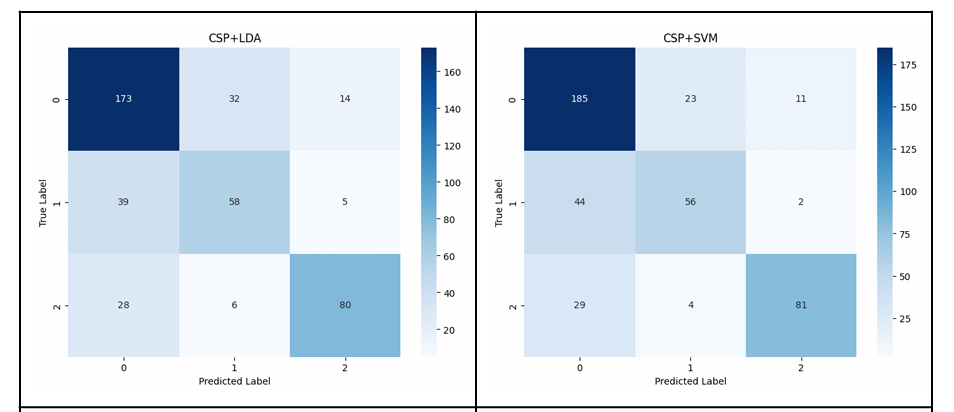
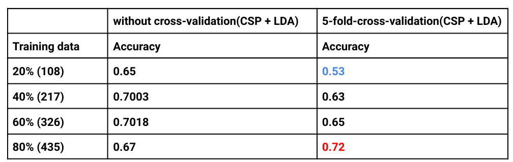
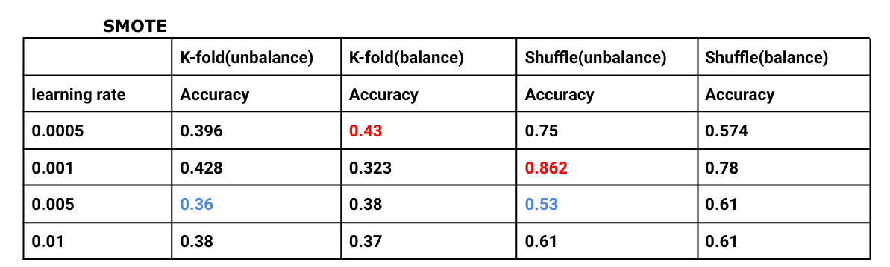

<h1 align="center">MI-BCI-UnityKart</h1>

  <h4>This project is the application of Brain-Computer Interface, using Motor Imagery to control a kart in the game</h4>

## Related Works
- [Cognitive Engineering and Computational Neuroscience Lab - Alexander Edward Hutomo](https://github.com/xEvheMary/MI-BCI-UnityKart?tab=readme-ov-file)

## Workflow

  

This game was designed by [Alexander Edward Hutomo](https://github.com/xEvheMary) , using motor imagery to control a kart in the game.

## Method
### Machine Learning
1. **CSP + LDA**
2. **CSP + SVM**

### Deep learning
1. **EEGNet**

## Results

### Confusion Matrix

  

### Graph
Machine Learning

  

Deep Learning

  

