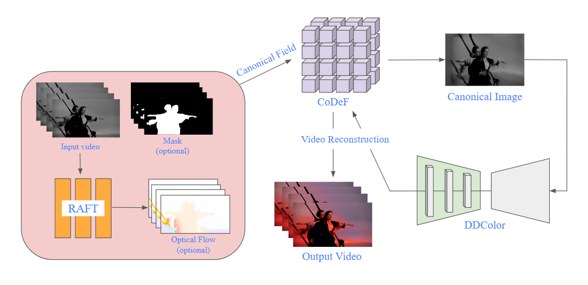
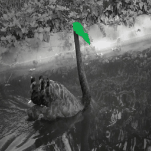

# AI-Capstone
- Instructor: [Prof. Tsai-pei Wang ](https://robotics.nycu.edu.tw/tw/teachers/show.php?num=132&page=2)
- Semester : 2024 Spring

## Project 1
MI BCI Application on Unity Kart Game

**Key feature:**
- EEGNet
- ICA & PCA 

## Project 2

## Final Project - Editable Video Colorization

### Related Work
- [DDColor: Towards Photo-Realistic Image Colorization via Dual Decoders](https://github.com/piddnad/DDColor)
- [CoDeF: Content Deformation Fields for Temporally Consistent Video Processing](https://github.com/qiuyu96/CoDeF)

### Pipeline

  

### Results
#### Colorization

  

#### Editing

  

### License
This project is licensed under the MIT License - see the [LICENSE](LICENSE) file for details.
